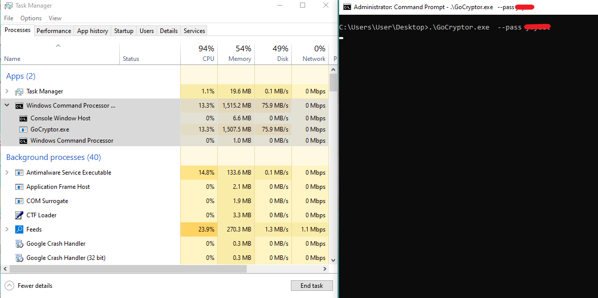

# GoCryptor (GoCrypt) 

 

## Description

The project is a proof-of-concept ransomware written in GoLang that I developed to better understand GoLang executables.

The cryptor is inspired by ransomwares written in C/C++ that I have analyzed. It contains simple malware tricks such as string hashing, process termination, service killing, and, of course, file encryption.

For file encryption, **GoCryptor** uses a hybrid cryptosystem of ChaCha20 and Curve25519 to encrypt files and protect its key. It uses a pretty bad DFS recursive algorithm to traverse to the file system. Maybe I'll implement multithreading for that sometime in the future.

The project strictly as serves as a proof-of-concept created for educational purposes only. Please be mindful when installing and running this malware.

As the author, I am not to be held responsible for any damage as a direct or indirect result of this software.

## Table of Contents ()

- [GoCryptor (GoCrypt)](#gocryptor-gocrypt)
  - [Description](#description)
  - [Table of Contents ()](#table-of-contents-)
  - [Installation](#installation)
  - [Usage](#usage)
  - [Credits](#credits)

## Installation

To install the project, make sure you have GoLang installed on your machine.

Below is a list of external GoLang libraries from GitHub that the project uses.

To install the dependencies, run the following command:

```
go get github.com/pierrec/lz4
go get golang.org/x/crypto
go get github.com/rodolfoag/gow32
go get golang.org/x/sys/windows
go get github.com/go-ole/go-ole
go get github.com/jaypipes/ghw
go get github.com/jeandeaual/go-locale
```

To clone and build the project, run the following commands:

```
git clone https://github.com/cdong1012/GoCryptor
go build GoCryptor
```

This will produce a Windows executable that you can run.

## Usage

The executable requires some parameter to run.

```
./GoCryptor.exe --pass <password to run>
./GoCryptor.exe --pass <password to run> --path <path to encrypt>
```



I will unfortunately not provide the password, so cracking the hash is left as an exercise for the user.

## Credits

Huge thanks to the devs of the following repositories that allows the development of this project.

- [github.com/pierrec/lz4/v4](https://github.com/pierrec/lz4)
- [github.com/golang.org/x/crypto](https://github.com/golang/crypto)
- [github.com/rodolfoag/gow32](https://github.com/rodolfoag/gow32)
- [github.com/golang.org/x/sys/windows](https://github.com/golang/sys/tree/master/windows)
- [github.com/go-ole/go-ole](https://github.com/go-ole/go-ole)
- [github.com/jaypipes/ghw](https://github.com/jaypipes/ghw)
- [github.com/jeandeaual/go-locale](https://github.com/jeandeaual/go-locale)
